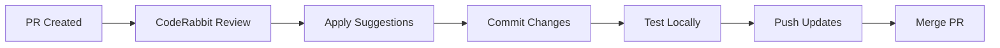

# DeGenie Development Workflow & Best Practices

## Mejores Prácticas para Evitar Conflictos de Git

### 1. **Flujo de Trabajo Recomendado**

#### Antes de comenzar cualquier trabajo:
```bash
# 1. Actualizar main branch
git checkout main
git pull origin main

# 2. Crear nueva rama desde main actualizado
git checkout -b feat/nueva-funcionalidad

# 3. Trabajar en la funcionalidad
# 4. Hacer commits frecuentes y descriptivos
```

#### Durante el desarrollo:
```bash
# Verificar cambios en main periódicamente
git fetch origin

# Si hay cambios en main, integrarlos temprano
git checkout main
git pull origin main
git checkout feat/nueva-funcionalidad
git merge main
# Resolver conflictos inmediatamente
```

### 2. **Gestión de CodeRabbit**

#### Aplicar sugerencias inmediatamente:
1. **Lee las sugerencias de CodeRabbit cuando aparezcan**
2. **Aplica las mejoras de inmediato** (no esperes semanas)
3. **Haz commits específicos para mejoras de CodeRabbit**:
   ```bash
   git commit -m "fix: apply CodeRabbit recommendation - improve error handling"
   ```

#### Ejemplo de implementación inmediata:
```typescript
// ❌ Antes (versión base)
app.use(express.static('public'));

// ✅ Después (con recomendación de CodeRabbit)
app.use(express.static(path.join(__dirname, '../../public')));
```

### 3. **Estrategia de Commits**

#### Tipos de commits:
- `feat:` nueva funcionalidad
- `fix:` corrección de bugs
- `refactor:` mejoras de código (CodeRabbit)
- `docs:` documentación
- `test:` tests
- `style:` formato de código

#### Commits frecuentes y pequeños:
```bash
# ✅ Mejor - commits específicos
git commit -m "feat: add user authentication middleware"
git commit -m "fix: apply CodeRabbit - preserve HTTP status codes in error handler"
git commit -m "refactor: improve type safety in API endpoints"

# ❌ Evitar - commits grandes
git commit -m "various improvements and fixes"
```

### 4. **Manejo de Conflictos**

#### Resolución proactiva:
1. **Mergear main frecuentemente** (cada 1-2 días)
2. **Usar merge en lugar de rebase** para branches con muchos cambios
3. **Resolver conflictos manteniendo mejoras de calidad**

#### Orden de prioridades en conflictos:
1. **Mantener mejoras de CodeRabbit** (seguridad, tipos, validación)
2. **Preservar funcionalidad nueva**
3. **Integrar cambios de main sin romper mejoras**

### 5. **Gestión de Archivos Generados**

#### Ignorar archivos compilados:
```gitignore
# En .gitignore
dist/
build/
*.map
.next/
node_modules/
```

#### No versionar archivos temporales:
- `dist/` folder (TypeScript compilado)
- Cache files (`.next/cache/`)
- Lock files conflictivos

### 6. **Flujo con CodeRabbit**

#### Proceso recomendado:


#### Comando para aplicar sugerencias rápidamente:
```bash
# Script para aplicar mejoras de CodeRabbit
./scripts/apply-coderabbit-suggestions.sh
```

### 7. **Herramientas de Automatización**

#### Pre-commit hooks:
```bash
# .husky/pre-commit
#!/bin/sh
npm run lint:fix
npm run typecheck
git add .
```

#### Scripts útiles:
```json
{
  "scripts": {
    "sync-main": "git checkout main && git pull origin main",
    "update-branch": "npm run sync-main && git checkout - && git merge main",
    "quality-check": "npm run lint && npm run typecheck && npm run test",
    "apply-fixes": "npm run lint:fix && npm run format"
  }
}
```

### 8. **Comunicación del Equipo**

#### Notificaciones importantes:
- **Avisar cuando main tiene cambios grandes**
- **Coordinar mejoras de CodeRabbit en canal de desarrollo**
- **Documentar breaking changes**

#### Canal de coordinación:
```markdown
📢 **Main branch updated** 
- New Solana contracts added
- Updated dependencies
- Please sync your branches: `npm run update-branch`
```

### 9. **Testing Local**

#### Antes de push:
```bash
# Verificar que todo funciona
npm run build
npm run test
npm run lint

# Probar cambios localmente
npm run dev
```

#### Verificar integración:
```bash
# Test de integración después de merge
cd src/ai-services/image-gen
npm run build
npm run test:integration
```

### 10. **Documentación de Cambios**

#### Mantener changelog:
```markdown
## [1.2.0] - 2024-01-09
### Added
- CodeRabbit security improvements
- Enhanced error handling
- Better static file serving

### Fixed
- HTTP status code preservation
- Path resolution for static assets
```

## Implementación Inmediata

Para resolver los conflictos actuales y futuras mejoras:

1. **Aplicar las dos sugerencias de CodeRabbit**:
   - ✅ Fixed: Static path resolution
   - ✅ Fixed: Error status preservation

2. **Establecer pre-commit hooks** para aplicar mejoras automáticamente

3. **Mergear main frecuentemente** (cada 1-2 días máximo)

4. **Commits específicos para CodeRabbit** en lugar de acumular cambios

5. **Testing local completo** antes de cada push

**Resultado esperado**: Cero conflictos en futuros PRs y mejor calidad de código.